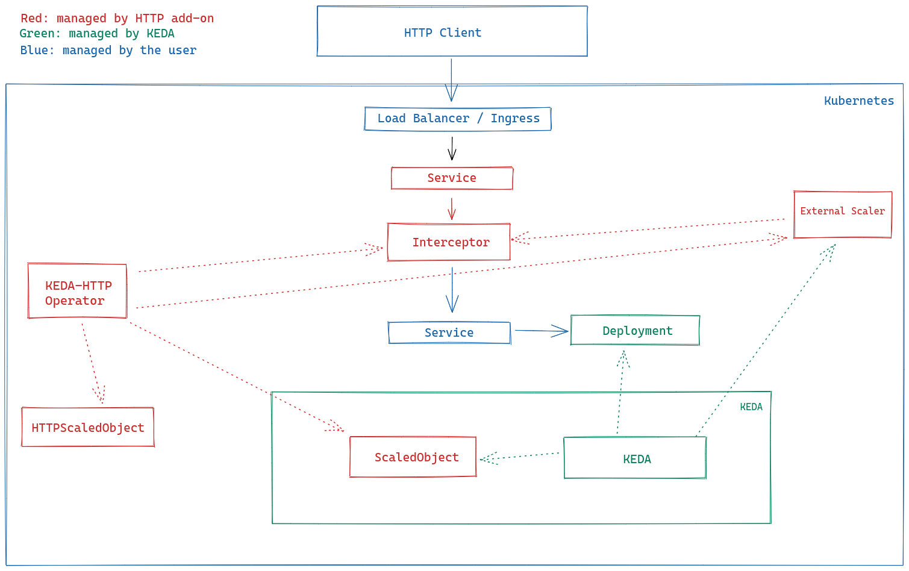
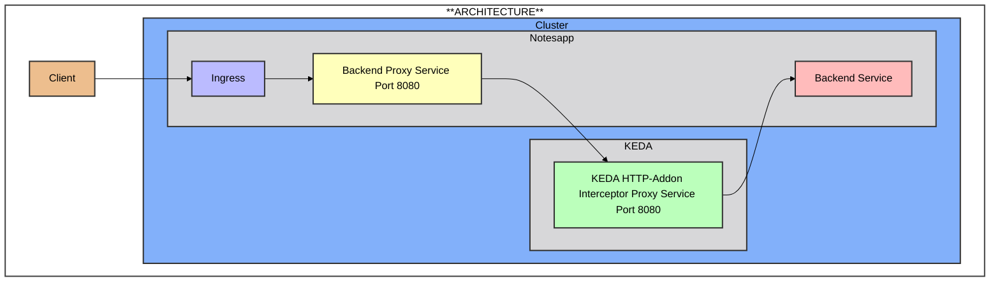

# KEDA (Kubernetes Event-Driven Autoscaling)

KEDA is a Kubernetes-based Event Driven Autoscaler that allows applications to scale based on the number of events they need to process. It provides a flexible and efficient way to handle event-driven workloads in Kubernetes by automatically adjusting the number of pods in response to incoming events.

## Key Features

- **Event-Driven Scaling**: Scale your applications based on event metrics from various sources such as message queues, databases, and more.
- **Custom Metrics**: Define custom metrics to trigger scaling actions.
- **Seamless Integration**: Works with existing Kubernetes components and tools.
- **Multiple Scalers**: Supports a wide range of scalers for different event sources.

## Use Cases

- **Queue Processing**: Automatically scale the number of workers based on the length of a message queue.
- **Event-Driven Applications**: Scale applications in response to events from various sources like Kafka, RabbitMQ, or Azure Event Hubs.
- **Custom Metrics**: Use custom metrics to scale applications based on specific business logic.

## HTTP-Based KEDA

KEDA also supports HTTP-based scaling, allowing you to scale your applications based on HTTP traffic. This is particularly useful for web applications and APIs that need to handle varying levels of incoming HTTP requests efficiently.

### HTTP Addon by KEDA

The HTTP Addon by KEDA extends KEDA's capabilities to support HTTP-based scaling. It provides an easy way to scale your HTTP workloads by automatically adjusting the number of pods based on incoming HTTP traffic. The HTTP Addon integrates seamlessly with KEDA and leverages its powerful scaling mechanisms to ensure your applications can handle traffic spikes and maintain optimal performance.

### Architecture



This diagram represents the architecture of the KEDA HTTP Add-on and how it integrates with Kubernetes to provide HTTP-based autoscaling for workloads.

**1. HTTP Client (User):**

- This represents incoming HTTP traffic from users, applications, or external clients.

**2. Load Balancer / Ingress (User)**

- This is the entry point for external HTTP requests.
- In Kubernetes, this can be Ingress (e.g., Nginx Ingress Controller) or an external LoadBalancer Service.

**3. Interceptor Service (KEDA HTTP Add-on)**

- Requests first go to this interceptor service instead of the user’s application directly.
- The interceptor helps measure traffic and decide when to scale up/down the backend pods.

**4. KEDA-HTTP Operator (KEDA HTTP Add-on)**

- Watches for HTTPScaledObject (a CRD that defines autoscaling behavior).
- Works with the External Scaler to determine how many replicas are needed.

**5. External Scaler (KEDA HTTP Add-on)**

- Receives traffic metrics from the interceptor.
- Tells KEDA how many replicas are needed to handle the traffic.

**6. ScaledObject (KEDA HTTP Add-on)**

- This is a KEDA resource that represents the scaling rules.
- It links HTTP traffic metrics to the backend Deployment.

**7. KEDA (KEDA Core)**

- The KEDA autoscaler adjusts the number of pods based on demand.
- If traffic increases, KEDA increases replicas; if traffic decreases, it scales down.

**8. Backend Service & Deployment (User)**

- After scaling decisions are made, requests are forwarded to the user-managed service.
- This service routes traffic to the Deployment (Pods) running the application.

## Use Cases

- **Queue Processing**: Automatically scale the number of workers based on the length of a message queue.
- **Event-Driven Applications**: Scale applications in response to events from various sources like Kafka, RabbitMQ, or Azure Event Hubs.
- **Custom Metrics**: Use custom metrics to scale applications based on specific business logic.
- **HTTP Traffic**: Scale web applications and APIs based on incoming HTTP requests using the HTTP Addon by KEDA.

## Set up

### Installing KEDA

```
kubectl create ns keda
helm repo add kedacore https://kedacore.github.io/charts
helm repo update
helm install keda kedacore/keda --namespace keda --create-namespace
```

### Install HTTP-Add-on

`helm install http-add-on kedacore/keda-add-ons-http --namespace keda`

### Deploy your app in the cluster

```
kubectl apply -f ./manifests-notesapp/namespace.yaml
kubectl apply -f ./manifests-notesapp/database
kubectl apply -f ./manifests-notesapp/backend
kubectl apply -f ./manifests-notesapp/frontend
kubectl apply -f ./manifests-notesapp/common/ingress.yaml
```


